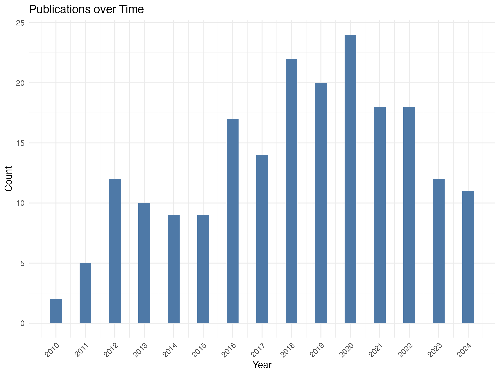

```{r setup, include=FALSE}
knitr::opts_chunk$set(echo = TRUE)
#install.packages("pak")
#install.packages("posterdown")
pak::pak('rstudio/pagedown')
library(dplyr)
library(readtext)
library(tidyverse)
library(gt)
library(ggplot2)
library(dplyr)
library(knitr)
library(readr)
library(kableExtra)
library(bibliometrix)
library(tidyverse)
library(DiagrammeR)
library(DiagrammeRsvg)
library(rsvg)
library(quanteda)
library(stringr)
library(tidytext)
library("quanteda.textmodels")
library("quanteda.textstats")
library("quanteda.textplots")
require(quanteda.corpora)
library(here)
here::i_am("poster-template.Rmd")
```

```{r, eval=F, include=FALSE}
pagedown::chrome_print("poster-template.Rmd")
```

# Abstract

We conducted a systematic review of the U.S. research literature on Black male educator retention. Study findings reveal that Black male educators face social, identity, and systemic challenges, including disproportionate disciplinary expectations, racialized role assignments, and structural inequities, which contribute to their underrepresentation in public schools.

# Overview

**Role Strain and Racialization**

Black males are often typecast as disciplinarians for "troubled" students, reinforcing deficit-based assumptions. This racialization process places an inequitable burden, diverting focus from their pedagogical contributions (Bristol & Mentor, 2018).
 
**Structural Barriers**

- *Representation*: The absence of Black male role models in leadership positions exacerbates feelings of isolation and undervaluation.

- *Workplace Climate*: Lack of administrative support and culturally responsive development.

# Literature Review

- Black male educators express an oftentimes overwhelming amount of extra pedagogical responsibilities (Britol & Mentor, 2018; Brockenbrough, 2012). This includes the expectation to play an extra role in a Black boy's upbringing in the Educational system then just a teacher. This can come in the form of a surrogate father or a disciplinary figure of some kind.

- Rather than calling more Black male teachers due to their educational talents, the calls for Black men is situated with the policy discussions addressing the school performances of Black boys. This assumes that all Black male educators are equipped with the tools or experiences to reach Black boys (Lynn, 2006). 

# Research Question

1. What is the intellectual and conceptual structure of the research literature in the United States on retaining Black male educators in K-12 settings?

# Methods

This study synthesizes insights from trends in the research literature. Computational methods were used to identify core studies in the sample of studies (n = 203) on Black male educator retention.

```{r, echo=F, include=F, message=F, warning=F}
# Create the framework
tmp = DiagrammeR::grViz('digraph model {

    graph [layout = dot, overlap = true]
    
    node [shape=box]
    {"Scoping"} -> {"Review"} -> {"Reduction"};
 
    node [shape=box]
    {"Keywords"} -> {"Sources = 73"} -> docs;
    
    node [shape=box]
    docs [label=<Documents, n = 203>];
    
# `edge` statements
 
    edge [minlen = 2]
    docs -> {"Concepts" -> Themes}

 }') 

# Display the graph
tmp

# Export to SVG
tmp_svg = DiagrammeRsvg::export_svg(tmp)

# Convert SVG to raw vector
tmp_raw = charToRaw(tmp_svg)

# Save as PNG
rsvg::rsvg_png(tmp_raw, "img/analytic-framework.png", width = 3000, height = 2400)


```

{width=80%}

```{r, include=F, message=F, warning=F}
data <- readtext("savedrecs.txt") # Load the data
D <- convert2df(file=data, dbsource= "wos", format= "plaintext")
dim(D)
```

```{r, include=F, message=F, warning=F}
D_cleaned <- D %>% 
  filter(PY > 2009, PY < 2025) %>%                   # 2010-2024
  filter(DT == "ARTICLE" | DT == "ARTICLE; EARLY ACCESS") %>% 
  filter(grepl("EDUCATION & EDUCATIONAL RESEARCH", SC)) %>%  # At least 1 SC is EDUCATION
  filter(TC != 0)
dim(D_cleaned)
```

```{r, include=F, message=F, warning=F}
# create an object of the study results
results <- biblioAnalysis(D_cleaned, sep = ";") # entire data set

options(width=100)
S <- summary(object = results, k = 10, pause = F)
```

# Findings

```{r, echo=F, message=F, warning=F}
kable(S[2])
```


```{r, include=F, warning=F}
S[9]
```

```{r, include=F, message=F, warning=F}
counts <- D_cleaned %>%
  group_by(PY) %>%
  summarise(count = n())
```

```{r, include=F, message=F, warning=F}
year_plot <- ggplot() + 
  geom_col(data = counts, 
           aes(x = PY, y = count), 
           width = 0.4,
           fill = "#4E79A7") +  # Replace with any hex color
  theme_minimal() +
  labs(x = "Year", y = "Count", title = "Publications over Time") +
  scale_x_continuous(breaks = seq(min(counts$PY), max(counts$PY), by = 1)) +
  theme(axis.text.x = element_text(angle = 45, hjust = 1),
        legend.title = element_blank(),
        legend.position = "top")

print(year_plot)

# Save the plot as a high-resolution PNG
ggsave("img/year_plot.png", plot = year_plot, width = 8, height = 6, units = "in", dpi = 300, bg = "white")
```

## Publications over Time

{width=90%}

## Keywords

```{r, echo=F, message=F, warning=F}
kable(S[10])
```

## Most frequently cited documents

Articles build on studies from the 1990s and 2000s.

```{r, include=F, message=F, warning=F}
CR_educ <- citations(D_cleaned, field = "article", sep = ";")
```

```{r, echo=F, message=F, warning=F}
kable(cbind(CR_educ$Cited[1:5]))
```

# Discussion

We find that there are consistent recommendations in the research literature on strategies for retention:

- *Mentorship and leadership pathways*: Programs providing peer support and career growth opportunities help sustain Black male educators.

- *Holistic support systems*: Financial incentives, micro-credentialing, and partnerships between districts, universities, and policymakers address both recruitment and retention needs.

- *Advocacy platforms*: Spaces for Black male educators to engage in policy discussions empower them to shape systemic change.

# Conclusion

This systematic scoping review examines the research literature on the retention of Black male educators in U.S. schools. While recent studies indicate a decline in scholarly attention to this topic post-2020, the persistent underrepresentation of Black male educators and evolving systemic challenges call for further qualitative inquiry.

# Acknowledgements

This work was supported by funding from the Alfred P. Sloan Foundation (Grant 2023-21062).

# References

Bristol, T. J., & Mentor, M. (2018). Policing and Teaching: The Positioning of Black Male Teachers as Agents in the Universal Carceral Apparatus. *The Urban Review, 50*(2), 218–234.

Brockenbrough, E. (2012). "You ain’t my daddy!": Black Male Teachers and the Politics of Surrogate Fatherhood. *International Journal of Inclusive Education, 16*(4), 357–372.

Lynn, M. (2006). Education for the Community: Exploring the Culturally Relevant Practices of Black Male Teachers. *Teachers College Record, 108*(12), 2497–2522.

Pabon, A. J. M. (2016). In hindsight and now again: Black male teachers’ recollections on the suffering of black male youth in US public schools. *Race Ethnicity and Education, 20*(6), 766–780.